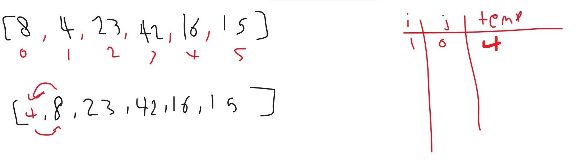
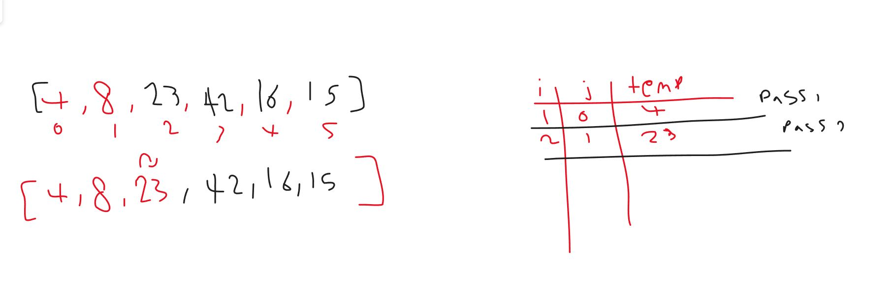
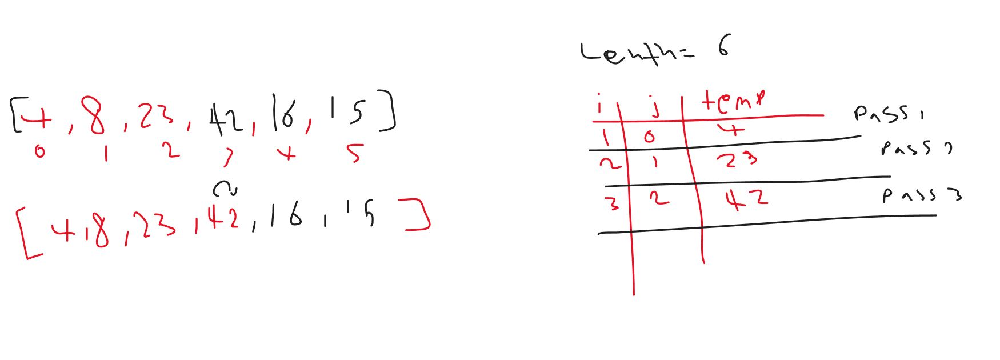
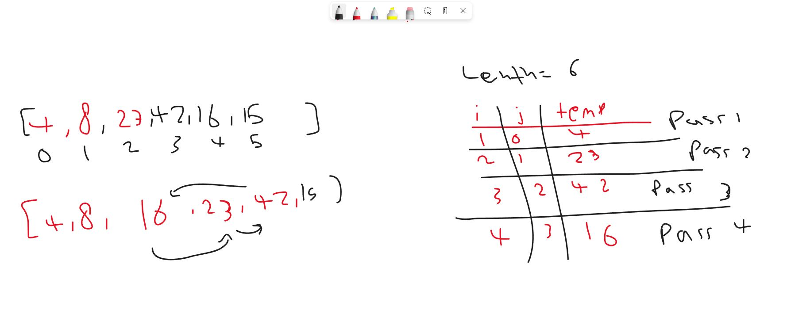
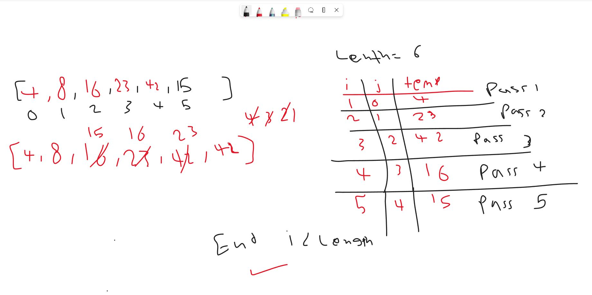

# Insertion Sort 
in this method we sort  array  asc لby  saving previous  element in temp variable

pass 1 : 

in this pass fist i become 1 and  j = 0 
then enter while loop 
in while loop it replaced 4 to be 8
and decrement j 
then check while loop again it will be false 
then replace 8 to 4 (temp)

pass 2 :

in this pass fist i become 2 and j = 1
then enter while loop
in while loop it replaced 23 to be 23
and decrement j
then check while loop again it will be false
then replace 23 to 23 (temp)

no change

pass 3 :

in this pass also no change 

pass 4 :

in this pass fist i become 4 and j = 3 temp =16
then enter while loop
in while loop it replaced 42 to be 23
and decrement j
then check while loop again it will be false
then replace 23 to 16 (temp)

no change

pass 5 :

in this pass fist i become 5 and j = 4 temp =15
then enter while loop
in while loop it replaced 16 to be 15
and in while loop it replaced 23 to be 16
and in while loop it replaced 42 to be 23
and in while loop it replaced 15 to be 42

and decrement j
then check while loop again it will be false
then replace 16 to 15 (temp)

