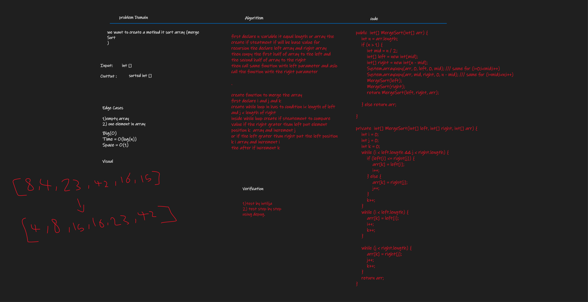

# Challenge Summary
merge sort is the method to sort an array in best time complexity
, it dived the array into 1 element then  start compare each array has left and right let .


## Whiteboard Process


## Approach & Efficiency
TIME = O(nLogn) AND SPACE O(N)
## Solution

````
JUST CALL THE FUNCTION IN MAIN CLASS APP CLASS (APP)
 App classUnderTest = new App();
classUnderTest.MergeSort(new int[]{8,4,23,42,16,15})

WE CAN SHOW EXAMPLE IN MAIN CLASS (APP)

````
