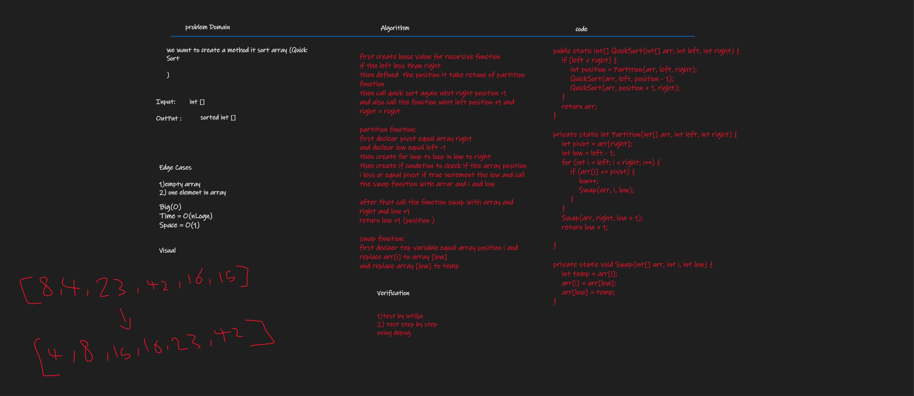

# Challenge Summary
Quick Sort is the method to sort an array in best time complexity and best space complexity
, it operates in concept divider and conquer , it selects a pivot and make all element lees than it to the left and grater than it to the right .


## Whiteboard Process


## Approach & Efficiency
time = nlog(n) , space = o(1)

## Solution
JUST CALL THE FUNCTION IN MAIN CLASS APP CLASS (APP)
````
App app = new App();
app.QuickSort(new int[]{8,4,23,42,16,15})

WE CAN SHOW EXAMPLE IN MAIN CLASS (APP)

```
