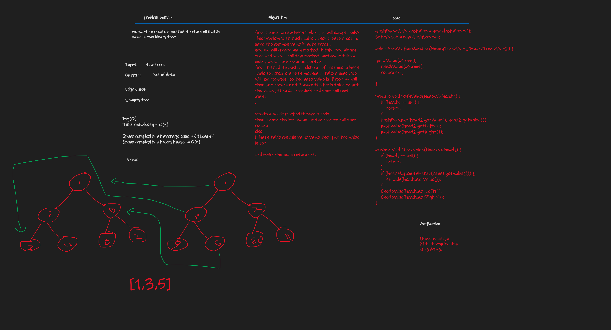

# Hashtables
the hashTable is the type of data-structures it operated to save key and value ,
the concepts of adding or putting in  hashtable is by hash the key and get the remainder of this hash 
value in size or bound on buckets or slots, we have tow algorithm to hashing or get index  or handel the 
collision:

1- chaining  by use linedList 
2- open addressing :

a- linear : `hash the key and + i and mod into table size`

b - quadratic : `hash the key and + i^2 and mod into table size `

d - double hash : `in this way we are hashing two times : `

``
(hash 1 +hash2 *i) mod into table size
``

## Challenge
we want to implement hash table and add method (put , get , contain, hash)

## Approach & Efficiency
Time complexity and space complexity:
```
put method {
Time :
avarege case : o(1) 
worst case : o(n)
Space :
o(n)
}

keys method {
Time :
 o(n*n) =n(n^2)
Space :
o(n)
}

remove method {
Time :
avarege case : o(1) 
worst case : o(n)
Space :
o(n)
}

contains method : {
Time :
avarege case : o(1) 
worst case : o(n)
Space :
best case : o(1) 
avarage case : o(n)

}

get method {
Time :
avarege case : o(1) 
worst case : o(n)
Space :
 o(n)
}


```

## API
initialise hashtable and add bound
HashTable<Integer,String> hash= new HashTable<>(5);
put method
hash.put(key,value) 
remove method
hash.remove(key)
hash.contain(key)
hash.get(key)
hash.keys()


# Challenge 31

# Challenge Summary
we want to create a function that finds the first word to occur more than once in a string


## Whiteboard Process
.png)
## Approach & Efficiency

Time : O(N)  on average case  because we split the string, and we're looping inside the split array then it's depend on the 

String length then it took O(N) but on worst case it o(n^2)

SPACE : we declare another array it depends on the length or string so the space O(N)


## Solution

```
i created class it has the method it's usined hash table so just call 
the method becouse it static
HashTableMethod.repeatedWord("a aaa adsdsa aaa ")

you can look at the example in the app class
```


# Challenge 32

# Challenge Summary
we want to create a method it returns all match value in tow binary trees


## Whiteboard Process

## Approach & Efficiency

Time : O(N)
Space complexity at average case = O(Log(n))
Space complexity at worst case  = O(n)


## Solution

```
create CommonDataTrees class
and call the method .
 CommonDataOnTrees<String> t = new CommonDataOnTrees<>();
 t.findMatcher(b1,b2)
you can create a binary tree by create instance from

 BinaryTree<String> b1 = new BinaryTree<>();
you can look at the example in the app class
```
