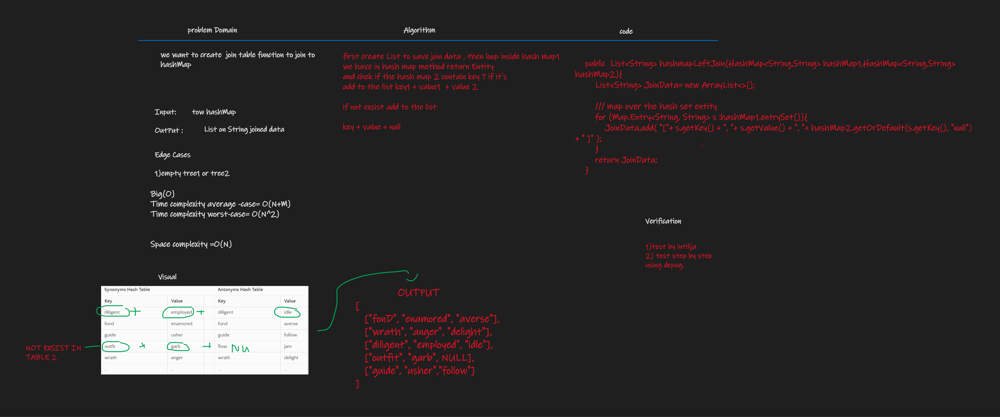

# Hashmap LEFT JOIN
the hashmap join use in database method to join to table such as relationship .

## Challenge
we want to create  join table function to join to hashMap

## Approach & Efficiency
Big(O)
Time complexity average -case= O(N+M)
Time complexity worst-case= O(N^2)
Space complexity =O(N)

## Solution

